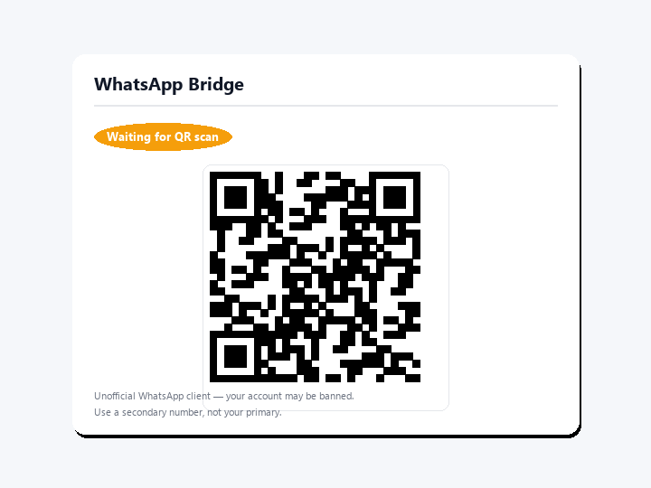
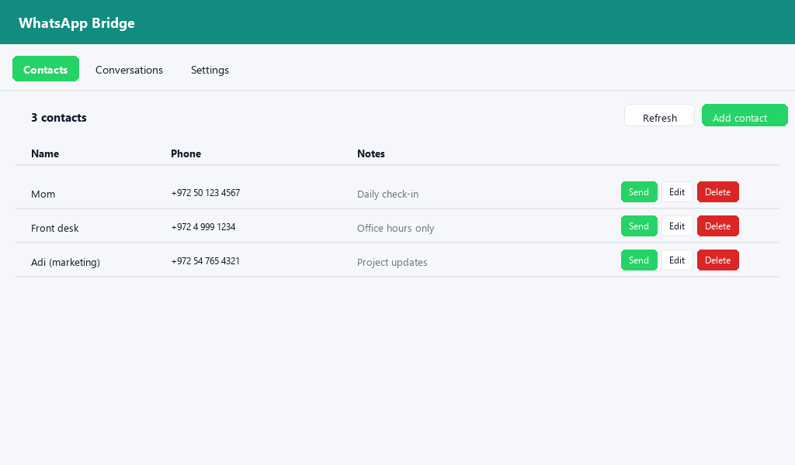

# WhatsApp Bridge

> ⚠️ **Unofficial WhatsApp client.** This integration uses
> [`whatsapp-web.js`](https://wwebjs.dev/) inside a companion add-on.
> WhatsApp's Terms of Service do not allow bot-style use of personal accounts.
> Your account may be banned. **Use a secondary phone number, not your primary one.**

| QR pairing card | Phonebook panel |
|---|---|
|  |  |

Send and receive WhatsApp messages from Home Assistant automations.

## Features

- `notify.whatsapp` notify platform.
- `whatsapp_bridge.send_text`, `send_media`, `send_location` services.
- Phonebook sidebar panel with full CRUD.
- `whatsapp_message_received` event for incoming messages.
- Lovelace QR card for one-tap pairing.
- Connection / battery / state sensors.

## Requirements

- Home Assistant OS or Supervised — the integration depends on the
  [WhatsApp Bridge add-on](https://github.com/bareli/whatsapp-bridge-addon).
- Architectures: amd64, aarch64.

## Setup

1. Install the **WhatsApp Bridge add-on** (separate repository).
2. Start the add-on, copy the printed API token.
3. Add this repository to HACS twice: once as **Integration**, once as **Plugin**.
4. Restart Home Assistant.
5. Settings → Devices & Services → Add Integration → "WhatsApp Bridge".
6. Add the QR card to a Lovelace dashboard and scan with your phone.
